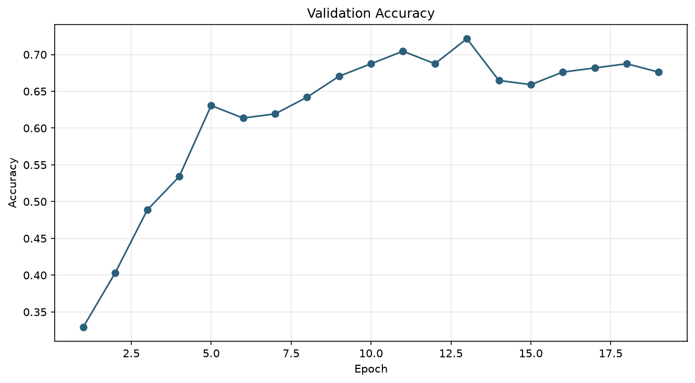
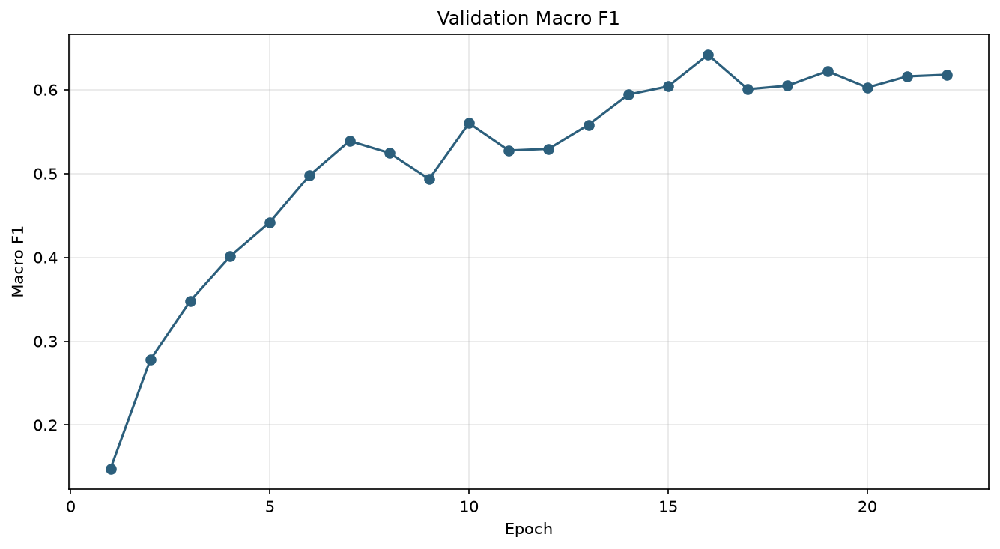
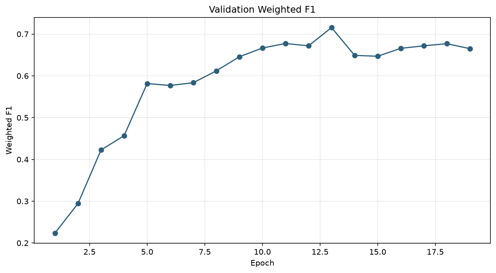
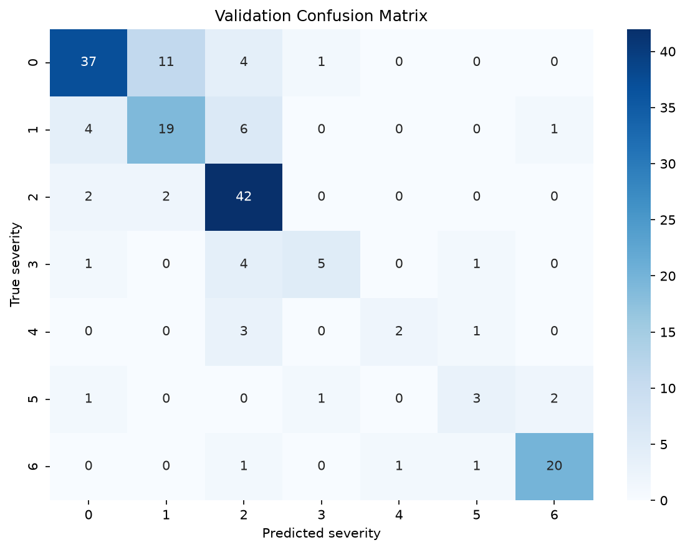
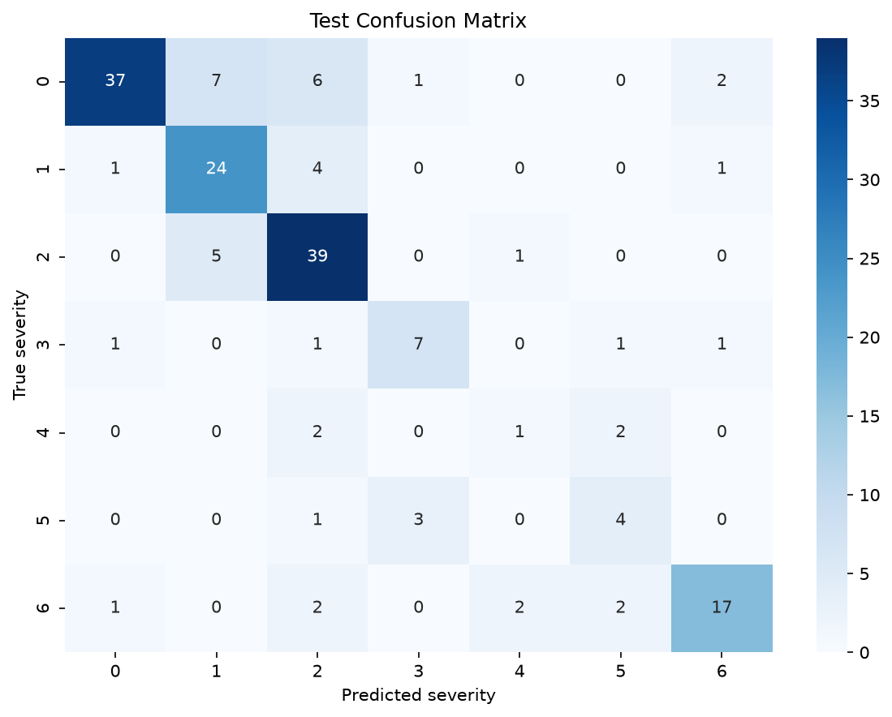
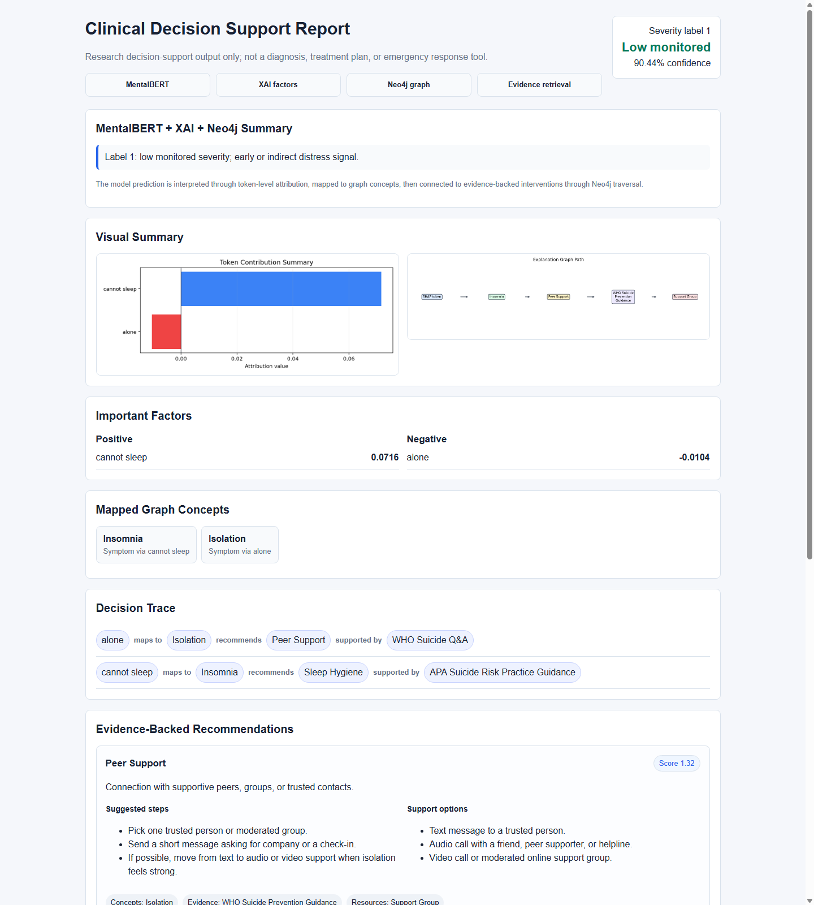
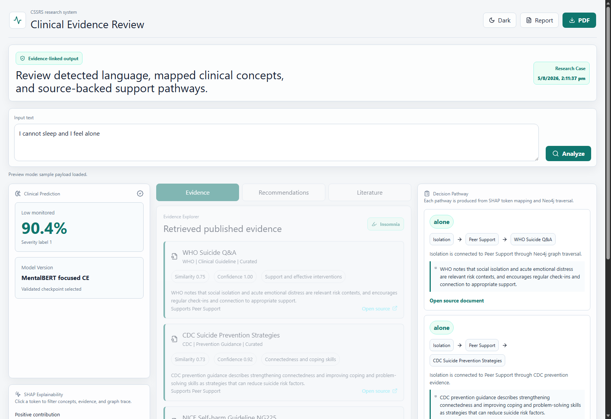

# MentalBERT-CSSR

Fine-tuning MentalBERT for suicide severity classification with C-SSRS labels.

This project trains `mental/mental-bert-base-uncased` on Reddit post text from
the `content` column and predicts human severity labels in `severity` (`0`-`6`).
LLM label columns are kept only for later benchmarking and are never used as
training targets.

> Ethical note: this is a research classification pipeline, not a clinical
> diagnostic or crisis-intervention system.

## Project Structure

```text
.
|-- configs/
|   `-- default.yaml
|-- DATA/
|   |-- RAW/
|   |   `-- human_n_llm_labeled_rSuicidewatch_posts.csv
|   `-- processed/
|       |-- cssrs_processed.csv
|       `-- splits/
|           |-- train.csv
|           |-- val.csv
|           `-- test.csv
|-- NOTEBOOKS/
|-- RESULTS/
|   |-- metrics/
|   `-- plots/
|-- api/
|   |-- app.py
|   `-- dashboard_service.py
|-- dashboard/
|   |-- package.json
|   `-- src/
|-- docs/
|   `-- assets/
|-- saved_model/
|-- scripts/
|   |-- run_pipeline.py
|   |-- run_training.py
|   |-- run_evaluation.py
|   |-- run_ordinal_experiments.py
|   |-- run_focused_experiments.py
|   |-- build_knowledge_graph.py
|   |-- run_shap_explanation.py
|   |-- generate_clinical_report.py
|   `-- compare_checkpoints.py
|-- knowledge_graph/
|-- xai/
|-- utils/
|-- README.md
`-- requirements.txt
```

## Setup

Use Python 3.11+ and install the project requirements:

```bash
python -m venv .venv

# Windows
.venv\Scripts\activate

# Linux/macOS
source .venv/bin/activate

pip install -r requirements.txt
```

The pipeline uses CUDA automatically when available. The MentalBERT model is
gated on Hugging Face, so accept the model terms and log in if the weights are
not already cached locally.

## Main Pipeline

Train and then evaluate the best checkpoint:

```bash
python scripts/run_pipeline.py
```

Evaluate the configured checkpoint without retraining:

```bash
python scripts/run_pipeline.py --skip-training
```

Evaluate a specific checkpoint:

```bash
python scripts/run_evaluation.py --model-path saved_model/focused_experiments/best_model_focused_ce_do_0_20_lr_1_2e5_ls_0_03.pt
```

Compare all tuned checkpoints against validation and test splits:

```bash
python scripts/compare_checkpoints.py --include-current
```

## Final Model

The final model selected for SHAP/LIME and downstream explanation is
`focused_ce_do_0_20_lr_1_2e5_ls_0_03`.

- Loss: cross entropy
- Learning rate: `1.2e-5`
- Dropout: `0.20`
- Weight decay: `0.02`
- Label smoothing: `0.03`
- Class weights: disabled
- Weighted sampler: disabled
- Checkpoint selection: composite score using weighted F1, macro F1, and
  quadratic weighted kappa
- Best epoch: `13`

This focused CE model is used as the main model because it gives the strongest
overall F1 balance while remaining simpler to explain with softmax
probabilities and word-level SHAP/LIME attributions.

## Best Results

Final checkpoint:
`saved_model/focused_experiments/best_model_focused_ce_do_0_20_lr_1_2e5_ls_0_03.pt`

| Split | Accuracy | Macro F1 | Weighted F1 | Loss |
| --- | ---: | ---: | ---: | ---: |
| Train | 95.48% | 84.08% | 94.61% | 0.2925 |
| Validation | 72.16% | 61.31% | 71.55% | 1.0703 |
| Test | 73.30% | 62.68% | 73.35% | 0.9863 |

## Retained Comparison Model

The ordinal CE model is retained for explanation and ablation, but it is not the
main SHAP/LIME model:

Checkpoint:
`saved_model/ordinal_experiments/best_model_ordinal_ce_dw_0_30_do_0_25.pt`

| Model | Test Accuracy | Test Macro F1 | Test Weighted F1 | Test QWK | Test Within-1 | Test High-Severity F1 |
| --- | ---: | ---: | ---: | ---: | ---: | ---: |
| Final focused CE | 73.30% | 62.68% | 73.35% | 79.32% | 85.80% | 78.87% |
| Retained ordinal CE | 73.86% | 60.23% | 72.55% | 81.66% | 87.50% | 80.00% |

The ordinal model remains useful because severity labels are ordered from `0` to
`6`, so QWK, within-1 accuracy, and high-severity F1 show whether mistakes stay
near the correct severity band. The focused CE model is kept as final because it
has the best macro and weighted F1 for class-level explanation.

### Training Curves







### Confusion Matrices





## Dataset Schema

| Column | Role |
| --- | --- |
| `content` | Model input text |
| `severity` | Human ground-truth label (`0`-`6`) |
| `gpt_label`, `claude_label`, `gemini_label`, `llama_label`, `mistral_label` | Benchmark only |
| `url`, `author`, `created` | Metadata |

## Neo4j XAI Clinical Decision Support

This extension keeps the final focused CE MentalBERT model unchanged, then adds
a deterministic post-classification pipeline:

```text
User text -> MentalBERT prediction -> SHAP explanation -> Neo4j traversal
          -> evidence-backed interventions -> structured clinical report
```

Start Neo4j locally at `bolt://localhost:7687`, then set the password in your
terminal. The password is read from the environment and is not committed.

```powershell
$env:NEO4J_PASSWORD="your-neo4j-password"
```

Build the seed clinical knowledge graph:

```bash
python scripts/build_knowledge_graph.py
```

Run SHAP explanation for one input:

```bash
python scripts/run_shap_explanation.py --text "I feel hopeless and alone"
```

Generate the full structured report:

```bash
python scripts/generate_clinical_report.py --text "I feel hopeless and alone"
```

### HTML Report Preview

The latest report UI includes a severity badge, MentalBERT + XAI + Neo4j method
summary, SHAP chart, explanation graph path, decision trace, recommendation
cards, support options, and evidence links.



Outputs:

- SHAP artifacts: `RESULTS/xai/shap/`
- Clinical reports: `RESULTS/xai/reports/`
- Visual report assets: `<run_id>_shap_chart.png` and
  `<run_id>_graph_path.png` beside each Markdown report

The Neo4j graph stores curated evidence as document-style nodes:

```text
EvidenceDocument -> HAS_SECTION -> EvidenceSection -> HAS_CHUNK -> EvidenceChunk
EvidenceChunk -> SUPPORTS -> Intervention
```

Current seed documents include WHO suicide Q&A, NICE NG225 self-harm guidance,
APA-oriented suicide-risk practice guidance, and a behavioral activation
clinical review placeholder. Chunks are short, traceable evidence passages with
`chunk_id`, `document_name`, `section_title`, `url`, and `citation` fields.
Recommendations also include structured action steps and support options such as
text check-ins, audio calls, video calls, helplines, professional support, and
support groups when those are linked in the graph.

The report is research decision-support output only. It is not a diagnosis,
treatment plan, or emergency response tool. Recommendations are retrieved from
Neo4j graph links and evidence nodes rather than generated by an LLM.

## V2 Explainable Clinical Dashboard

The V2 dashboard adds a modern clinical research interface on top of the same
final MentalBERT model and Neo4j XAI pipeline. V1 scripts are unchanged.

```text
User text -> MentalBERT -> SHAP/fallback attribution -> concept mapping
          -> Neo4j traversal -> evidence cards -> React dashboard
```

V2 guarantees no LLM use after prediction. The dashboard displays model
metadata, SHAP tokens, graph concepts, retrieved evidence chunks, graph-selected
recommendations, and report export links.

Backend API:

```powershell
$env:NEO4J_PASSWORD="your-neo4j-password"
.venv\Scripts\python.exe -m uvicorn api.app:app --host 127.0.0.1 --port 8000
```

Frontend dashboard:

```powershell
cd dashboard
npm.cmd install
npm.cmd run dev
```

Open `http://127.0.0.1:5173`. If the API is not running, the UI opens with a
sample payload so the design can still be reviewed.

If another local app is already using `5173`, run:

```powershell
npm.cmd run dev -- --host 127.0.0.1 --port 5174 --strictPort
```



V2 API endpoints:

| Endpoint | Purpose |
| --- | --- |
| `GET /api/health` | Confirms the API is running and no post-prediction LLM is used |
| `POST /api/analyze` | Runs prediction, explanation, graph traversal, evidence retrieval, and report export |
| `GET /api/report/html` | Opens an exported HTML report from `RESULTS/xai/reports/` |

V2 dashboard sections:

- Clinical prediction: severity label, risk band, confidence, probabilities,
  model version
- SHAP explorer: clickable positive and negative token attributions
- Evidence explorer: source cards with evidence level, section, snippet,
  similarity score, and original source link
- Source coverage: WHO, NICE, CDC, SAMHSA, APA-oriented guidance, and curated
  clinical review chunks where available
- Decision pathway: detected words mapped to clinical concepts, graph-selected
  guidance, evidence snippets, and source links
- Recommendation explorer: graph-selected interventions with mapped concepts,
  evidence, action steps, and support options
- Literature panel: searchable retrieved evidence chunks by source family
- Export controls: open HTML report and browser print-to-PDF

## Outputs

Training writes checkpoints to `saved_model/` and metrics/plots to `RESULTS/`.
Evaluation writes split summaries, reports, confusion matrices, and predictions
under `RESULTS/metrics/evaluation/` by default.

Dataset CSVs, checkpoints, and generated full result folders are intentionally
ignored by Git to avoid publishing sensitive data or large artifacts.
